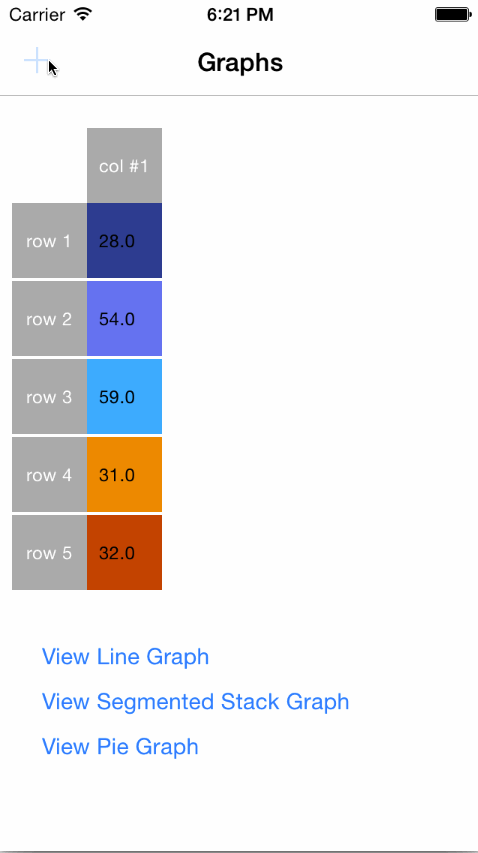

# iOSCharts

This framework aims to provide an easy way to visualize a set of data using “off the shelf” solutions for Line Graph, Stacked Bar Graph and Pie Chart, allowing the user to change the data source by adding or removing new values. 

The user also has the possibility to change the colours used in the graphs and to add custom names for the rows and columns of the data source. 
The framework allows further extension with new types of graphs or customised properties for the graphical overlays (axis, graph or values overlay) based on the code provided in the Framework project.

It is available starting with IOS 8.0 and later and can be used with both Swift and Objective-C programming languages.



## Demo run

To run demo IOSCharts is needed. To fetch it, run Carthage command in terminal:

```
cd {PROJECT_DIR}
carthage update
```

## Installation

Link your application against the framework. Add the framework to the list of 'Embedded Binaries' from the project's General tab.

### Carthage

- Update your Cartfile by adding:

```
github "3pillarlabs/ios-charts"
```

- Run carthage by using command:

```
carthage update
```

## Usage

Basic steps in using the framework:

1. Create a graph view of type LineGraphView, PieChartView or SegmentedStackView
2. Create a data source
3. Set the graph's data source

**Swift**

```swift
import IOSCharts

//you can instantiate in the same way PieChartView or SegmentedStackView instead of LineGraphView
let graph = LineGraphView(frame: CGRect(x: 0, y: 0, width: 200, height: 300))

//create a DataSource
let inputTable = GraphInputTable(name: "GraphCustomName")
//add as many rows as you want
inputTable.rows = [ GraphInputRow(name: "rowName 1", tintColor: UIColor.grayColor()),
		            GraphInputRow(name: "rowName 2", tintColor: UIColor.greenColor())]
//set the data Source
graph.inputTable = inputTable
//populate the data source with random values
let values: [Double] = inputTable.rows.map {_ in return Double(arc4random_uniform(100))}
inputTable.addColumn("col name", rowValues: values)

```
**Objective-C**

```Objective-C
Make sure in Build Settings, Embedded Content Contains Swift Code is set to "YES"

import <IOSCharts/IOSCharts.h>
//you can instantiate in the same way PieChartView or LineGraphView instead of SegmentedStackView
SegmentedStackView *graph = [[SegmentedStackView alloc] initWithFrame:CGRectMake(0, 0, 200, 300)];

//create a DataSource
GraphInputTable *inputTable = [[GraphInputTable alloc] initWithName:@"SegmentedStackView"];
inputTable.rows = @[[[GraphInputRow alloc] initWithName:@"row1" tintColor:[UIColor redColor]],
					[[GraphInputRow alloc] initWithName:@"row2" tintColor:[UIColor greenColor]]];
//set the data Source					
self.segmentedStackView.inputTable = inputTable;
    
int numberOfColumns = 2;
int numberOfRows = (int)[inputTable.rows count];

//populate the data source with random values    
for (int j = 0; j < numberOfColumns; j++) {
	NSMutableArray *rowValues = [[NSMutableArray alloc] init];
   for (int i = 0; i < numberOfRows; i++) {
   		[rowValues addObject:[NSNumber numberWithInt:arc4random_uniform(100)]];
   }
   [inputTable addColumn:@"column" rowValues:rowValues];
}					

```

## License

iOSCharts is released under MIT license. See [LICENSE](LICENSE) for details.  

## About this project

[](http://www.3pillarglobal.com/)

**iOSCharts** is developed and maintained by [3Pillar Global](http://www.3pillarglobal.com/).
